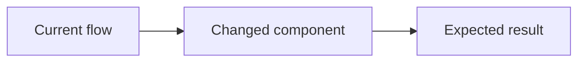

## What's the change?

<!-- Summarize what this pull request changes. -->

## Why is this change needed?

<!-- Explain the problem, requirement, or goal behind this change. -->

## Files changed

<!-- Add one row for every file modified or created. Remove the example row. -->

| File name | Modified / Created | What's the change? |
| --- | --- | --- |
| `path/to/file` | Modified | Briefly describe the change |

## Change flow diagram

<!-- Update this Mermaid diagram to show the flow affected by this pull request. -->

## Screenshots

<!-- Drag and drop screenshots into the table. Use N/A when the change has no visual impact. -->

| Before | After |
| --- | --- |
| Attach screenshot or N/A | Attach screenshot or N/A |

## How was this tested?

<!-- Required: list the commands or steps used to test this pull request. -->

- Test command or steps:
- Expected result:
- Actual result:

## Where was this tested?

<!-- Required: describe the environment where testing was completed. -->

- Environment (local, Docker, staging, etc.):
- OS:
- Relevant service or configuration:

## Checklist

- [ ] I described what changed and why.
- [ ] I listed every modified or created file in the table.
- [ ] I updated the Mermaid diagram for the changed flow.
- [ ] I attached relevant screenshots or marked the section as N/A.
- [ ] I tested the changes and documented how and where they were tested.
- [ ] I added or updated tests where appropriate.
- [ ] I confirmed that no secrets or sensitive data are included.