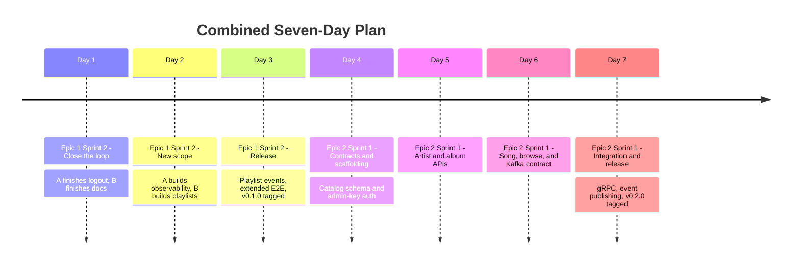

# Combined Seven-Day Plan — Epic 1 Sprint 2 + Epic 2 Sprint 1

This is a single continuous seven-day block combining two separate sprint
plans:

- **Days 1-3:** [Epic 1 Sprint 2](Epic%201/Sprint%20Tracker/Sprint%202/Sprint2_TODOS.md) — closes out the User Identity & Listener Profile Service (finishes logout, metrics, and docs left over from Epic 1 Sprint 1; adds playlists, the one EPICS.md scope item Sprint 1 never planned; tags `v0.1.0` for the first time).
- **Days 4-7:** [Epic 2 Sprint 1](Epic%202/Sprint%20Tracker/Sprint%201/Sprint1_TODOS.md) — builds the core of the Music Catalog Management Service (schema, CRUD, browse, Kafka events, gRPC; bulk import and full observability/docs deferred to a future Epic 2 Sprint 2); tags `v0.2.0`.

Each sprint has its own full TODOS / Tracker / Learning Outcome documents,
linked above — this file is a single-page view across both, not a
replacement for them.

---

## Day-by-Day

| Day | Sprint | Developer A | Developer B | Merges | Release |
|---|---|---|---|---|---|
| **1** | Epic 1 Sprint 2 | Finish & merge E1-SS-06 (logout); start E1-SS-11 | Finish & merge E1-SS-12 (docs); start E1-SS-14 (playlist schema + CRUD) | 06, then 12 | — |
| **2** | Epic 1 Sprint 2 | Finish & merge E1-SS-11 (metrics/logging) | Finish & merge E1-SS-14 (playlists); start E1-SS-15 (playlist events) | 11, then 14 | — |
| **3** | Epic 1 Sprint 2 | Release captain: E1-SS-13 (extended E2E, CI, doc updates) | Finish & merge E1-SS-15; pair on E1-SS-13 | 15, then 13 | **`v0.1.0`** |
| **4** | Epic 2 Sprint 1 | E2-SS-02 service scaffolding + admin auth | E2-SS-01 catalog schema + domain contracts | 01, then 02 | — |
| **5** | Epic 2 Sprint 1 | E2-SS-04 album CRUD + artist linking | E2-SS-03 artist CRUD + full read API | 03, then 04 | — |
| **6** | Epic 2 Sprint 1 | E2-SS-06 browse/filter/pagination | E2-SS-05 song CRUD; then start E2-SS-08 (Kafka contract) | 05, then 06 | — |
| **7** | Epic 2 Sprint 1 | E2-SS-10 gRPC API; then pair as release captain | Finish E2-SS-08; then E2-SS-09 event publishing; then pair | 08, then 09, then 10, then 13 | **`v0.2.0`** |

---

## Mermaid Timeline

---

## What's explicitly not in this seven days

Both sprints deliberately deferred scope rather than overcommit:

- **Epic 1:** arbitrary playlist reordering, collaborative playlists — noted as Epic 1 follow-up work in `Sprint2_TODOS.md`'s Risk Controls.
- **Epic 2:** bulk catalog import (E2-SS-07), full Prometheus/zap observability (E2-SS-11), and full OpenAPI/Postman/architecture-diagram documentation (E2-SS-12) — all explicitly deferred to a future **Epic 2 Sprint 2**, not yet drafted. Their scope is preserved in `Sprint1_TODOS.md` so nothing is lost.

If the cadence holds, expect an **Epic 2 Sprint 2** request next, the same
way Epic 1 needed one.
