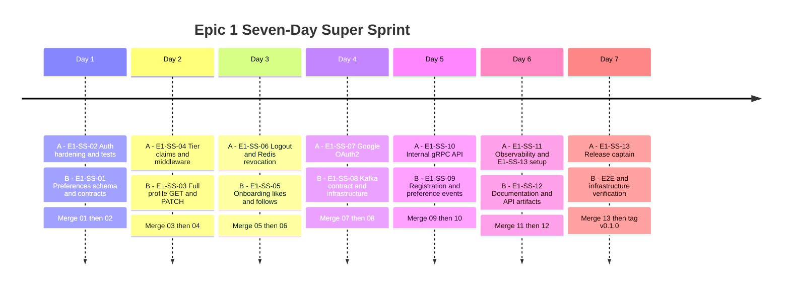
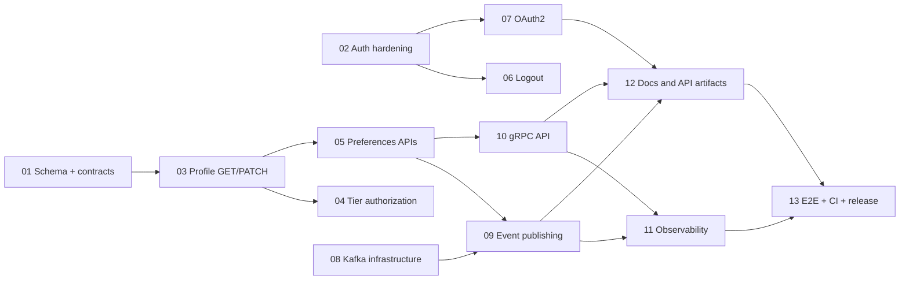

# Epic 1 - Seven-Day Sprint Tracker

**Sprint goal:** Complete and release the User Identity & Listener Profile Service as `v0.1.0`.

**Team split:**

- **Developer A:** auth, security, OAuth, runtime wiring, gRPC, observability, CI, and release.
- **Developer B:** profile, preferences, likes/follows, Kafka, Docker Compose, and API documentation.

**Working agreement:** B exposes constructors and interfaces. A owns final edits to `cmd/server/main.go`, `go.mod`, and `go.sum`. B owns migrations, event Protobuf definitions, and `docker-compose.yml`.

## Daily Trackers

- [Day 1 - Contracts and auth safety](day-1-contracts-and-auth.md)
- [Day 2 - Profile and tier authorization](day-2-profile-and-tier.md)
- [Day 3 - Preferences and logout](day-3-preferences-and-logout.md)
- [Day 4 - OAuth and Kafka infrastructure](day-4-oauth-and-kafka.md)
- [Day 5 - Events and gRPC](day-5-events-and-grpc.md)
- [Day 6 - Observability and documentation](day-6-observability-and-docs.md)
- [Day 7 - End-to-end release](day-7-release.md)

## Mermaid Timeline

## Dependency And Merge Flow

## Sprint-Level Checklist

- [ ] All 13 tickets merged in the required dependency order.
- [ ] Every P0 ticket reviewed by the developer who did not author it.
- [ ] `go test ./...` passes on the integrated branch every day.
- [ ] `go vet ./...` passes before release.
- [ ] Migration up/down passes against PostgreSQL 16.
- [ ] Docker Compose reports healthy PostgreSQL, Redis, Kafka, HTTP, and gRPC services.
- [ ] End-to-end flow passes twice from a clean environment.
- [ ] README, OpenAPI, Postman, and architecture diagram match the implementation.
- [ ] CI passes on the final default-branch commit.
- [ ] `v0.1.0` is tagged only after the final CI run passes.

## Daily Status Legend

- `[ ]` Not started
- `[~]` In progress; replace manually while tracking
- `[x]` Complete with evidence linked in the daily notes
- `[!]` Blocked; record owner, cause, and next action

At the end of each day, both developers must record the PR link, test command, test result, remaining blocker, and handoff for the next day in that day's tracker.