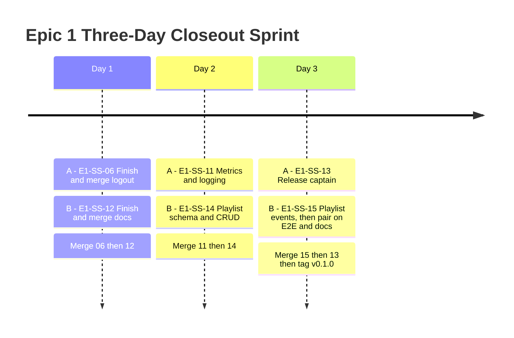
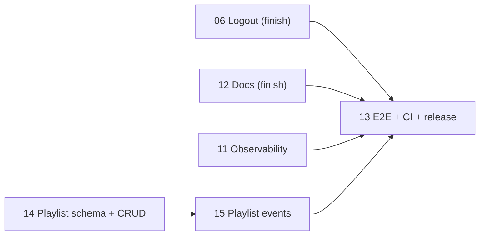

# Epic 1 - Three-Day Closeout Sprint Tracker

**Sprint goal:** Finish everything Sprint 1 left open, add playlists (the one EPICS.md scope item Sprint 1 never planned), and tag `v0.1.0` for the first time.

**Team split:**

- **Developer A:** finish logout, build metrics/logging/health, release captain.
- **Developer B:** finish docs, build playlists (schema, CRUD, events), pair on final E2E and doc updates.

**Working agreement:** same as Sprint 1 — A owns final edits to `cmd/server/main.go`, `go.mod`, and `go.sum`. B owns migrations, event Protobuf definitions, and `docker-compose.yml`.

## Daily Trackers

- [Day 1 - Close the loop](day-1-close-the-loop.md)
- [Day 2 - New scope](day-2-new-scope.md)
- [Day 3 - Release](day-3-release.md)

## Mermaid Timeline

## Dependency And Merge Flow

## Sprint-Level Checklist

- [ ] All 6 tickets merged in the required dependency order.
- [ ] E1-SS-06's branch rebased cleanly onto current `main` (5 PRs have landed since it was cut).
- [ ] `go test ./...` passes on the integrated branch every day.
- [ ] `go vet ./...` passes before release.
- [ ] Migrations `000008` and `000009` (playlists) apply and roll back cleanly on top of `000001`-`000007`.
- [ ] Docker Compose reports healthy PostgreSQL, Redis, Kafka, HTTP, and gRPC services.
- [ ] End-to-end flow — including playlists and logout — passes twice from a clean environment.
- [ ] README, OpenAPI, and Postman reflect logout and playlists, not just Sprint 1's original surface.
- [ ] CI passes on the final default-branch commit.
- [ ] `v0.1.0` is tagged for the first time, only after the final CI run passes.

## Daily Status Legend

- `[ ]` Not started
- `[~]` In progress; replace manually while tracking
- `[x]` Complete with evidence linked in the daily notes
- `[!]` Blocked; record owner, cause, and next action

At the end of each day, both developers must record the PR link, test command, test result, remaining blocker, and handoff for the next day in that day's tracker.
