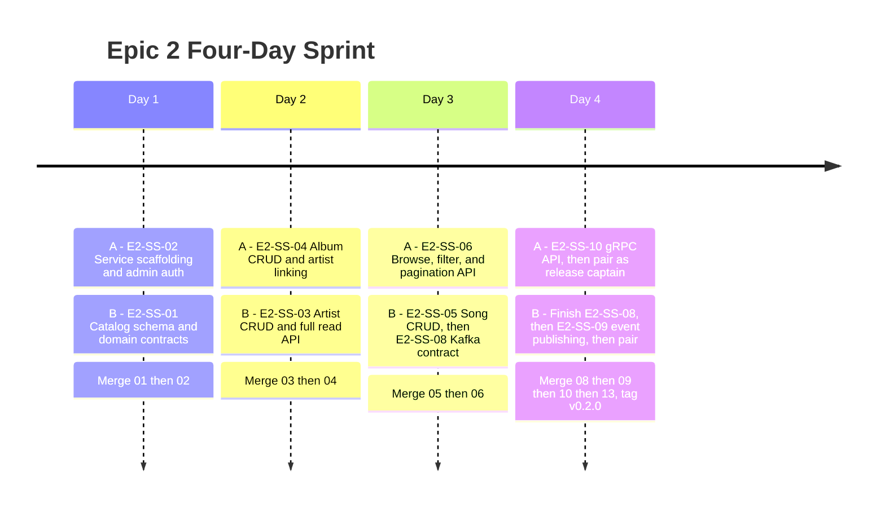
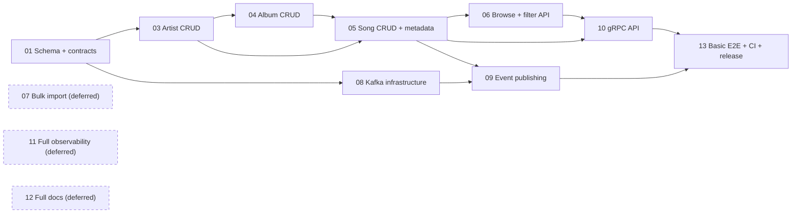

# Epic 2 - Four-Day Sprint Tracker

**Sprint goal:** Build and release the core Music Catalog Management Service (schema, CRUD, browse, events, gRPC) as `v0.2.0`. Bulk import, full observability, and full documentation are deferred to Epic 2 Sprint 2.

**Team split:**

- **Developer A:** service scaffolding, admin authorization, albums, browse/filter, gRPC, release.
- **Developer B:** catalog schema, artists, songs, Kafka events, Docker Compose additions.

**Working agreement:** B exposes constructors and interfaces. A owns final edits to `cmd/server/main.go`, `go.mod`, and `go.sum`. B owns migrations, event Protobuf definitions, and the catalog additions to `docker-compose.yml`.

## Daily Trackers

- [Day 1 - Contracts and scaffolding](day-1-contracts-and-scaffolding.md)
- [Day 2 - Artist and album APIs](day-2-artist-and-album.md)
- [Day 3 - Song catalog, browse, and eventing contract](day-3-song-browse-and-kafka-contract.md)
- [Day 4 - Integration and release](day-4-integration-and-release.md)

## Mermaid Timeline

## Dependency And Merge Flow

## Sprint-Level Checklist

- [ ] All 10 in-scope tickets (01-06, 08-10, 13) merged in the required dependency order.
- [ ] Every P0 ticket reviewed by the developer who did not author it.
- [ ] `go test ./...` passes on the integrated branch every day.
- [ ] `go vet ./...` passes before release.
- [ ] Migration up/down passes against PostgreSQL 16 for the new `muse_catalog` database.
- [ ] Docker Compose reports healthy Postgres, Kafka, and `catalog-svc` services.
- [ ] Basic end-to-end flow (create, browse, event, gRPC, update, delete) passes twice from a clean environment.
- [ ] A minimal README exists; full OpenAPI/Postman/diagram are explicitly deferred, not silently missing.
- [ ] CI passes on the final default-branch commit.
- [ ] `v0.2.0` is tagged only after the final CI run passes.
- [ ] E2-SS-07, E2-SS-11, and E2-SS-12 are recorded as the backlog for Epic 2 Sprint 2.

## Daily Status Legend

- `[ ]` Not started
- `[~]` In progress; replace manually while tracking
- `[x]` Complete with evidence linked in the daily notes
- `[!]` Blocked; record owner, cause, and next action

At the end of each day, both developers must record the PR link, test command, test result, remaining blocker, and handoff for the next day in that day's tracker.
