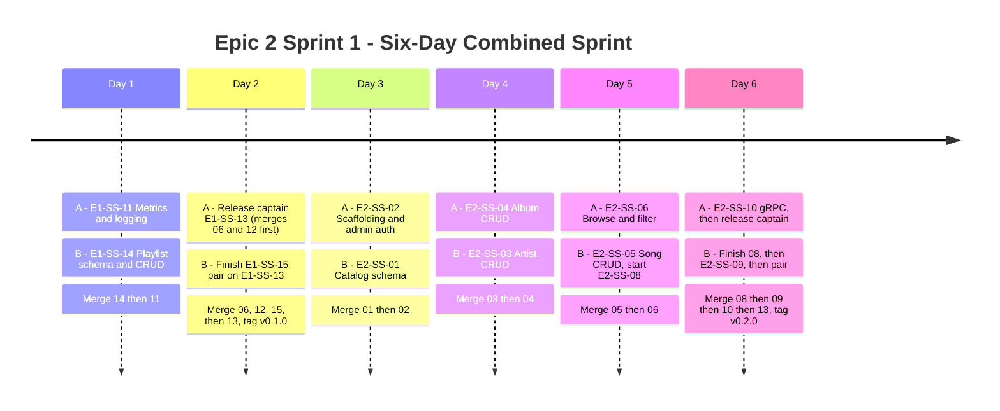
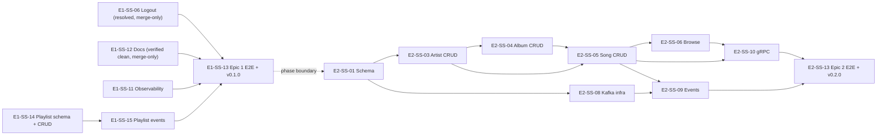

# Epic 2 Sprint 1 - Six-Day Combined Sprint Tracker

**Sprint goal:** Phase 1 (Days 1-2) closes out Epic 1's remaining work and tags `v0.1.0`. Phase 2 (Days 3-6) builds Epic 2's catalog core and tags `v0.2.0`.

**Status of the two carried-over tickets:** E1-SS-06 is actually resolved — merge commit `5a83591` on local branch `fix/e1-ss-06-resolve-conflicts`, verified via `go build`/`go vet`/`go test -race` (incl. real Postgres) plus a live logout smoke test. E1-SS-12 is verified clean on `chore/Doc`. Neither needs scheduled dev time — both are merge-only, tracked as their own row below rather than folded into a day. See `Sprint1_TODOS.md` for full detail.

**Team split:**

- **Developer A:** Phase 1 — E1-SS-11, release-captain E1-SS-13. Phase 2 — service scaffolding, admin auth, albums, browse/filter, gRPC, release-captain E2-SS-13.
- **Developer B:** Phase 1 — E1-SS-14, E1-SS-15, pair on E1-SS-13. Phase 2 — catalog schema, artists, songs, Kafka events.

**Working agreement:** A owns final edits to `cmd/server/main.go`, `go.mod`, and `go.sum`. B owns migrations, event Protobuf definitions, and Docker Compose additions.

## Daily Trackers

- [Day 1 - Metrics and playlist CRUD](day-1-metrics-and-playlists.md)
- [Day 2 - Merge 06/12, playlist events, Epic 1 release (v0.1.0)](day-2-epic1-release.md)
- [Day 3 - Catalog contracts and scaffolding](day-3-catalog-contracts.md)
- [Day 4 - Artist and album APIs](day-4-artist-and-album.md)
- [Day 5 - Song catalog, browse, and Kafka contract](day-5-song-browse-kafka.md)
- [Day 6 - Integration and Epic 2 release (v0.2.0)](day-6-epic2-release.md)

## Mermaid Timeline

## Dependency And Merge Flow

## Sprint-Level Checklist

**Merge-only (no scheduled dev time):**
- [ ] E1-SS-06's `fix/e1-ss-06-resolve-conflicts` branch merged into `main` and pushed to `origin`.
- [ ] E1-SS-12's `chore/Doc` branch pushed to `origin` and merged via reviewed PR.

**Phase 1:**
- [ ] E1-SS-11, E1-SS-14, E1-SS-15 merged.
- [ ] Extended E2E (incl. playlists, logout) passes twice.
- [ ] `v0.1.0` tagged.

**Phase 2:**
- [ ] All 10 in-scope tickets (01-06, 08-10, 13) merged in dependency order.
- [ ] Migration up/down passes for the new `muse_catalog` database.
- [ ] Docker Compose reports healthy Postgres, Kafka, and `catalog-svc`.
- [ ] Basic E2E (create, browse, event, gRPC, update, delete) passes twice.
- [ ] `v0.2.0` tagged.
- [ ] E2-SS-07, E2-SS-11, E2-SS-12 recorded as Epic 2 Sprint 2's backlog.

## Daily Status Legend

- `[ ]` Not started
- `[~]` In progress; replace manually while tracking
- `[x]` Complete with evidence linked in the daily notes
- `[!]` Blocked; record owner, cause, and next action

At the end of each day, both developers must record the PR link, test command, test result, remaining blocker, and handoff for the next day in that day's tracker.
