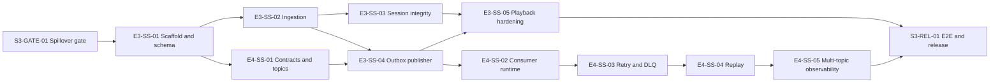

# Sprint 3 - Epic 3 and Epic 4 Completion Tracker

**Sprint goal:** Deliver the playback telemetry collection pipeline and the real-time Kafka processing platform, including durable publication, retry/DLQ, bounded replay, observability, and release evidence.

**Dates:** Record at kickoff  
**Team:** Developer A and Developer B  
**Duration:** 7 working days  
**Capacity:** 98 hours total; 88 planned; 10 protected for integration/recovery  
**Release target:** `v0.3.0`

The detailed contracts, estimates, and acceptance criteria are in [Sprint3_TODOS.md](Sprint3_TODOS.md). This tracker records execution evidence only.

---

## Starting Baseline

| Scope | Complete and merged | Open/in review | Not complete |
| --- | --- | --- | --- |
| Epic 1 | Implementation through playlists and playlist events | None identified | Historical `v0.1.0` release evidence/tag |
| Epic 2 | Catalog scaffold exists on branches/base history | PR #30; overlapping PR #29 | Remaining catalog schema/features, events, gRPC, docs, E2E/release |
| Epic 3 | None | None | Entire bounded Sprint 3 scope |
| Epic 4 | Kafka bootstrap and identity producers are reusable foundations | None | Consumer runtime, retry/DLQ, replay, platform observability |

**Baseline rule:** update this table only with merged PR/tag evidence. Branch-local code is not complete.

---

## Status Legend

- `[ ]` Not started
- `[~]` In progress
- `[R]` In review
- `[x]` Complete and merged with evidence
- `[!]` Blocked; owner, cause, and next action recorded
- `[C]` Cut from sprint with an explicit reason

---

## Sprint Board

| Status | ID | Story | Owner | Estimate | Dependencies | PR | Evidence |
| --- | --- | --- | --- | ---: | --- | --- | --- |
| [ ] | S3-GATE-01 | Resolve catalog scaffold overlap | A+B | 4h | None | | |
| [ ] | E3-SS-01 | Playback scaffold, schema, contracts | B | 10h | S3-GATE-01 | | |
| [ ] | E3-SS-02 | Authenticated single/batch ingestion | A | 8h | E3-SS-01 | | |
| [ ] | E3-SS-03 | Session semantics and integrity | A | 7h | E3-SS-02 | | |
| [ ] | E4-SS-01 | Topic topology and versioned contracts | B | 6h | E3-SS-01 | | |
| [ ] | E3-SS-04 | Transactional outbox and publication | B | 9h | E3-SS-01, E3-SS-02, E4-SS-01 | | |
| [ ] | E4-SS-02 | Consumer runtime and offsets | A | 9h | E4-SS-01, E3-SS-04 | | |
| [ ] | E4-SS-03 | Retry and dead-letter handling | B | 8h | E4-SS-02 | | |
| [ ] | E4-SS-04 | Operator-controlled replay | A | 7h | E4-SS-02, E4-SS-03 | | |
| [ ] | E3-SS-05 | Playback observability/hardening | A | 5h | E3-SS-02, E3-SS-03, E3-SS-04 | | |
| [ ] | E4-SS-05 | Multi-topic platform/observability | B | 7h | E4-SS-02, E4-SS-03, E4-SS-04 | | |
| [ ] | S3-REL-01 | E2E, CI, docs, `v0.3.0` | A+B | 8h | All above | | |

---

## Daily Execution Tracker

### Day 1 - Spillover gate and playback foundation

**Required result:** catalog overlap has one disposition; playback schema/scaffold PR is open.

- [ ] Compare PR #29 and PR #30 against current `main`.
- [ ] Preserve unique behavior, merge the authoritative E2-SS-02 path, and close only proven duplication.
- [ ] Record unresolved Epic 2 stories in backlog.
- [ ] B creates playback module, database, migrations, and domain contracts.
- [ ] A writes ingestion/auth contract tests against agreed DTOs.
- [ ] Confirm no cross-database foreign keys.

**End-of-day evidence:**

- PR(s):
- Tests/commands:
- Actual result:
- Blocker and owner:
- Handoff:
- Buffer consumed:

### Day 2 - Ingestion and Kafka contracts

**Required result:** E3-SS-01 and E3-SS-02 merged; E4 event contracts reviewed.

- [ ] A completes authenticated single and batch endpoints.
- [ ] B completes migration integration and E4-SS-01 Protobuf/topic contracts.
- [ ] Verify duplicate client event IDs are idempotent.
- [ ] Verify body user IDs cannot override JWT identity.
- [ ] Run migration up/down and race tests before merge.

**End-of-day evidence:**

- PR(s):
- Tests/commands:
- Actual result:
- Blocker and owner:
- Handoff:
- Buffer consumed:

### Day 3 - Session integrity and durable publication

**Required result:** session semantics and topic contracts merged; outbox path executable.

- [ ] A implements deterministic session query and quality flags.
- [ ] B completes E4-SS-01 and implements atomic ledger/outbox transaction.
- [ ] Confirm event-time vs ingest-time behavior.
- [ ] Confirm direct-publish failure leaves a relayable outbox record.

**End-of-day evidence:**

- PR(s):
- Tests/commands:
- Actual result:
- Blocker and owner:
- Handoff:
- Buffer consumed:

### Day 4 - Producer/consumer handoff

**Required result:** E3-SS-04 and E4-SS-02 merged in that order.

- [ ] B finishes direct publisher and fallback relay tests.
- [ ] A implements manual-commit consumer runtime and idempotency store.
- [ ] Run real Kafka producer-to-consumer integration test.
- [ ] Send SIGTERM during in-flight processing and verify graceful drain.

**End-of-day evidence:**

- PR(s):
- Tests/commands:
- Actual result:
- Blocker and owner:
- Handoff:
- Buffer consumed:

### Day 5 - Failure handling and replay

**Required result:** retry/DLQ merged; bounded replay works in integration.

- [ ] B implements retry classification, backoff/jitter, and DLQ envelope.
- [ ] A implements replay dry-run, bounded execution, separate group, and audit record.
- [ ] Prove source offsets remain uncommitted if retry/DLQ publication fails.
- [ ] Prove replay does not alter live group offsets.

**End-of-day evidence:**

- PR(s):
- Tests/commands:
- Actual result:
- Blocker and owner:
- Handoff:
- Buffer consumed:

### Day 6 - Hardening and platform observability

**Required result:** all feature stories merged; no P0 feature work enters Day 7.

- [ ] A completes playback limits, logs, metrics, and docs.
- [ ] B completes multi-topic configuration, streaming metrics, and runbook.
- [ ] Run mixed-topic failure-isolation test.
- [ ] Run security review for tokens, raw payloads, unbounded labels, and replay authorization.
- [ ] Freeze feature changes after the integration candidate is green.

**End-of-day evidence:**

- PR(s):
- Tests/commands:
- Actual result:
- Blocker and owner:
- Handoff:
- Buffer consumed:

### Day 7 - Clean E2E and release

**Required result:** clean flow passes twice, CI is green, exact commit is tagged `v0.3.0`.

- [ ] Start from clean checkout and empty service databases.
- [ ] Apply all migrations.
- [ ] Start identity, playback, Kafka, and streaming services.
- [ ] Authenticate and submit single/batch playback events.
- [ ] Verify ledger, outbox, Kafka publication, consumption, and idempotency.
- [ ] Force transient retry and poison-message DLQ.
- [ ] Run bounded replay and verify live offsets remain unchanged.
- [ ] Verify metrics, readiness, and graceful shutdown.
- [ ] Repeat the complete flow a second time.
- [ ] Merge release PR only after CI passes.
- [ ] Tag the exact verified commit `v0.3.0`.

**End-of-day evidence:**

- Release PR:
- First E2E result:
- Second E2E result:
- CI URL/result:
- Release commit:
- Tag verification:
- Residual risks/backlog:

---

## Dependency Flow

---

## Quality Gates

### Per PR

- [ ] Direct dependencies are already merged.
- [ ] Non-author review completed for P0 work.
- [ ] `gofmt -l .` returns no files in each changed Go module.
- [ ] `go vet ./...` passes in each changed Go module.
- [ ] `go test -race ./...` passes in each changed Go module.
- [ ] New migrations pass up and down.
- [ ] New contracts include source and generated code.
- [ ] No secret, token, or raw event payload is logged.
- [ ] PR description records commands and actual results.

### Sprint release

- [ ] No unresolved merge conflicts or uncommitted generated files.
- [ ] Compose config validates and all required services become healthy.
- [ ] Production containers build as non-root images.
- [ ] Vulnerability scan reports no reachable known vulnerability introduced by Sprint 3.
- [ ] Kafka outage, retry, DLQ, replay, and graceful shutdown drills pass.
- [ ] Documentation and operational runbook match actual commands.
- [ ] E2E passes twice from clean state.
- [ ] Release tag points to the green commit.

---

## Spillover Register

These items are intentionally visible but not part of Sprint 3 commitment unless the sprint finishes early and the product owner explicitly trades scope.

| Item | Status at kickoff | Owner for next planning decision | Why not in Sprint 3 |
| --- | --- | --- | --- |
| Epic 1 `v0.1.0` historical release/tag | Missing | Release owner | Historical process debt; does not unblock Epic 3/4 engineering. |
| E2-SS-01 catalog schema | Not merged | Epic 2 owner | Epic 3 stores opaque song UUIDs and does not require catalog CRUD. |
| E2-SS-03 through E2-SS-06 | Not merged | Epic 2 owner | Catalog feature work would consume the Epic 3/4 capacity. |
| E2-SS-08 through E2-SS-10 and E2-SS-13 | Not merged | Epic 2 owner | Catalog-specific events/gRPC/release are separate from playback streaming. |
| E2-SS-07, E2-SS-11, E2-SS-12 | Previously deferred | Epic 2 owner | Explicit deferred backlog remains unchanged. |

---

## Sprint Health Metrics

Update daily.

| Metric | Target | Current |
| --- | ---: | ---: |
| Planned hours | 88 | 88 |
| Protected buffer | 10 | 10 |
| P0 stories blocked over 1 day | 0 | 0 |
| Open P0 PRs older than 1 day | 0 | 0 |
| Stories merged | 12 | 0 |
| E2E clean passes | 2 | 0 |
| Untriaged spillover items | 0 | 0 |

## Final Outcome

- Epic 3 completion evidence:
- Epic 4 completion evidence:
- Release/tag:
- Scope cut, if any:
- Buffer used:
- What carries to Sprint 4:
