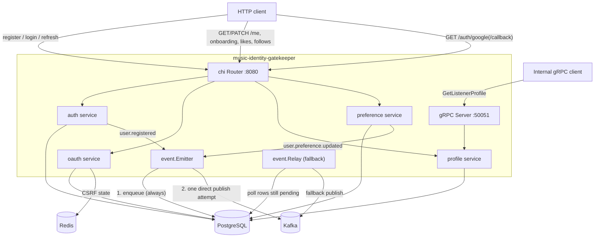

# music-identity-gatekeeper

User identity and listener profile service for the music-recommender-system
platform (Epic 1). Handles registration, login, Google OAuth2, subscription
tiers, listener profiles, preferences (onboarding, likes, follows), and
publishes domain events to Kafka. Exposes both an HTTP API and an internal
gRPC API.

## Prerequisites

- Go 1.26+
- Docker + Docker Compose
- [`golang-migrate` CLI](https://github.com/golang-migrate/migrate) (for `make migrate-up`/`migrate-down`)
- `protoc` 36.0 (only if regenerating protobuf/gRPC code — see [Protobuf generation](#protobuf-generation))

## Quick start

```bash
# From the repo root
git clone <repo-url> && cd music-recommender-system
docker compose up -d postgres redis kafka kafka-init

cd music-identity-gatekeeper
cp .env.example .env   # edit if you need real values; placeholders boot the server fine
make migrate-up
make dev                # http://localhost:8080, gRPC on :50051
```

Verify it's up:

```bash
curl -i http://localhost:8080/me   # expect 401 (unauthenticated) — confirms the server is running
```

## Environment variables

All loaded from `.env` (via `godotenv`) in local development, or real
environment variables in production/Docker. Copy `.env.example` to `.env`
to get started — every value there is a safe placeholder except `DB_URL`,
which already points at this repo's `docker-compose.yml` Postgres.

| Variable | Required | Default | Description |
|---|---|---|---|
| `DB_URL` | Yes | — | PostgreSQL connection string. |
| `JWT_SECRET` | Yes | — | HMAC signing secret for access/refresh JWTs. Server calls `log.Fatal` at startup if unset. |
| `GOOGLE_CLIENT_ID` | Yes | — | Google OAuth2 client ID. Server calls `log.Fatal` at startup if unset — **even if you're not testing OAuth.** Placeholder values are fine. |
| `GOOGLE_CLIENT_SECRET` | Yes | — | Google OAuth2 client secret. Same startup requirement as above. |
| `GOOGLE_REDIRECT_URL` | Yes | — | OAuth callback URL, e.g. `http://localhost:8080/auth/google/callback`. Same startup requirement as above. |
| `PORT` | No | `8080` | HTTP port. |
| `REDIS_ADDR` | No | `localhost:6379` | Redis address, used for OAuth CSRF state storage. |
| `LOG_LEVEL` | No | `info` | One of `debug`, `info`, `error`, `none`/`off` (case-insensitive). Unrecognized values also fall back to `info`. |
| `KAFKA_BROKERS` | No | unset | Comma-separated Kafka broker addresses, e.g. `localhost:9094`. If unset, events are still durably enqueued but published via a no-op publisher (discarded) instead of a real broker. |
| `KAFKA_RELAY_ENABLED` | No | `true` | On/off switch for the background outbox relay (the fallback sweep — see [Events & Kafka](#events--kafka)). Strict boolean (`1`/`t`/`T`/`TRUE`/`true`/`True`, `0`/`f`/`F`/`FALSE`/`false`/`False`). |
| `KAFKA_RELAY_INTERVAL` | No | `1m` | How often the relay fallback sweep wakes up. Go duration string, e.g. `30s`, `5m`. Non-positive or unparseable values fall back to `1m`. |

## Architecture



## API

### HTTP

Full request/response schemas: [`openapi.yaml`](./openapi.yaml). Runnable
examples: [`postman/music-identity-jwt.postman_collection.json`](./postman/music-identity-jwt.postman_collection.json).

**Public:**
- `POST /auth/register`, `POST /auth/login`, `POST /auth/refresh`
- `GET /auth/google` (begin OAuth), `GET /auth/google/callback`

**Authenticated** (`Authorization: Bearer <access_token>`):
- `GET /me`, `PATCH /me`
- `POST /me/onboarding`
- `POST /me/likes/songs/{songID}`, `DELETE /me/likes/songs/{songID}`, `GET /me/likes/songs`
- `POST /me/following/artists/{artistID}`, `DELETE /me/following/artists/{artistID}`

> **Known gap:** `POST /auth/logout` is planned (E1-SS-06) but not yet
> merged to `main`. Neither the OpenAPI spec nor the Postman collection
> include it yet — add it once that ticket lands. The Postman collection's
> Google OAuth request (`28. Google OAuth - Begin`) can only be run
> manually in a browser, not through Postman's runner — see the request's
> description.

### gRPC

The identity service runs `identity.v1.IdentityService` on port `50051`
alongside the HTTP server. `GetListenerProfile` accepts a listener UUID and
returns the subscription tier, genre seeds, language preferences, followed
artist IDs, and liked-song count.

Docker Compose exposes port `50051` only to the internal Compose network;
it is not published on the host. Other Compose services can connect to
`identity-svc:50051`. Production deployments must authenticate callers
with service identity or mTLS and must not expose this API publicly
without equivalent access controls.

Both the HTTP and gRPC servers share one graceful shutdown
(`cmd/server/serve.go`): on `SIGINT`/`SIGTERM`, the HTTP server stops
accepting new connections and gRPC does a `GracefulStop`, both bounded by
a 10-second timeout before a hard stop.

### Events & Kafka

Mutations (registration, onboarding, like/unlike, follow/unfollow) go
through a transactional outbox, not a fire-and-forget publish:

1. The event is **always** enqueued into the `kafka_integration` table first — this is the durability guarantee, independent of Kafka's availability.
2. `Emitter` then attempts **one** synchronous publish to Kafka immediately. Success marks the row `published` right away. Failure leaves it `pending` and increments `attempts` — the request is **not** retried from that thread, and the mutation still succeeds either way.
3. `Relay` is the fallback: a background sweep (`KAFKA_RELAY_INTERVAL`, default `1m`) that retries anything still `pending` — from a failed direct attempt, or from the process having no chance to attempt at all (e.g. a crash between enqueue and publish). `KAFKA_RELAY_ENABLED=false` disables only this fallback sweep, never the direct-publish step.

Topics: `user.registered`, `user.preference.updated`. Contract:
[`proto/identity/v1/events.proto`](./proto/identity/v1/events.proto)
(published as human-readable JSON via `protojson`, not binary protobuf —
query pending/published events directly with
`SELECT payload FROM kafka_integration`).

This service only **produces** — there is no consumer, and none is
planned in this sprint.

## Authentication & authorization

Access tokens are short-lived HS256 JWTs; refresh tokens rotate on use and
are rejected on reuse. See [`openapi.yaml`](./openapi.yaml) for exact
request/response shapes.

### Subscription tier authorization

Access tokens contain the listener's persisted `tier` claim. Premium
routes authorize only this signed claim; tier values supplied through
headers or request bodies are ignored.

After a subscription upgrade, the profile service returns a newly issued
token pair containing the updated tier. Existing access tokens remain
valid with their old tier claim until they expire, are refreshed, or are
explicitly reissued.

### Google OAuth2

Configure `GOOGLE_CLIENT_ID`, `GOOGLE_CLIENT_SECRET`, and
`GOOGLE_REDIRECT_URL`. Start authentication with `GET /auth/google`;
Google redirects to `GET /auth/google/callback`. A successful callback
returns the standard access and refresh token pair as JSON. Long-lived
tokens are never placed in redirect query parameters.

OAuth state is cryptographically random, stored in Redis only as a
SHA-256 hash, expires after 10 minutes, and is consumed atomically on
first callback use. Missing, invalid, expired, and replayed states are
rejected.

Only Google identities with a verified email are accepted. Existing
Google-created accounts may sign in, but an email already attached to a
local account returns `409 OAUTH_EMAIL_CONFLICT`; linking requires a
separate authenticated flow. Google-created users store no password hash.

## Testing

```bash
go test -race ./...                                    # everything; DB-/Kafka-gated tests self-skip if unset
DB_URL=... go test -race ./...                          # include Postgres-backed tests
DB_URL=... KAFKA_BROKERS=... go test -race ./...        # include Kafka integration tests too
```

> `make test` currently only runs `./internal/preference/... ./internal/profile/... ./internal/event/...`
> (there are two `test:` targets in the Makefile; Make silently uses the
> last one defined) — use `go test -race ./...` directly for the full
> suite, matching what CI actually runs.

Conventions: table-driven tests where it fits, a fake/mock for pure unit
tests, DB-backed integration tests that self-skip without `DB_URL`, Kafka
tests that self-skip without `KAFKA_BROKERS`.

## Manual smoke test

No automated end-to-end test exists yet (that's E1-SS-13). Until then, this
walks the golden path by hand against a server started per
[Quick start](#quick-start); requires `curl` and `jq`.

```bash
BASE=http://localhost:8080

# Register + log in
curl -s -X POST $BASE/auth/register -H 'Content-Type: application/json' \
  -d '{"email":"smoke@example.com","password":"Password123"}'
TOKENS=$(curl -s -X POST $BASE/auth/login -H 'Content-Type: application/json' \
  -d '{"email":"smoke@example.com","password":"Password123"}')
ACCESS=$(echo "$TOKENS" | jq -r .access_token)
AUTH=(-H "Authorization: Bearer $ACCESS")

# Profile read + patch
curl -s "${AUTH[@]}" $BASE/me
curl -s -X PATCH "${AUTH[@]}" -H 'Content-Type: application/json' \
  -d '{"country":"US"}' $BASE/me

# Onboarding
curl -s -X POST "${AUTH[@]}" -H 'Content-Type: application/json' \
  -d '{"genre_seeds":["pop","rock"],"language_prefs":["en"]}' $BASE/me/onboarding

# Like a song, list liked songs, unlike it
SONG=$(uuidgen)
curl -s -X POST "${AUTH[@]}" $BASE/me/likes/songs/$SONG
curl -s "${AUTH[@]}" $BASE/me/likes/songs
curl -s -X DELETE "${AUTH[@]}" $BASE/me/likes/songs/$SONG

# Follow an artist, unfollow it
ARTIST=$(uuidgen)
curl -s -X POST "${AUTH[@]}" $BASE/me/following/artists/$ARTIST
curl -s -X DELETE "${AUTH[@]}" $BASE/me/following/artists/$ARTIST

# Confirm the register/onboarding/like/follow mutations each enqueued a
# Kafka event (requires DB_URL exported in this shell)
psql "$DB_URL" -c "select topic, status from kafka_integration order by id desc limit 5;"
```

To also exercise the gRPC API, use [`grpcurl`](https://github.com/fullstorydev/grpcurl)
against `localhost:50051` with `proto/identity.proto`'s
`IdentityService.GetListenerProfile`, passing the registered user's ID.

## Migrations

```bash
make migrate-up            # apply all pending
make migrate-down          # revert the most recent one only
make migrate-down-clean    # revert everything
```

Migrations live in [`migrations/`](./migrations), numbered sequentially.
`000006` and `000007` briefly collided (two independent tickets both
picked `000006`) — resolved by renumbering; see
`Docs/common/DECISIONS_AND_GOTCHAS.md` if you're adding a new migration
and want to avoid a repeat.

## Protobuf generation

```bash
make proto-gen
```

Requires `protoc` 36.0 on `PATH` (the target checks the exact version and
fails otherwise) and installs pinned versions of `protoc-gen-go` and
`protoc-gen-go-grpc` itself, so generated output is reproducible. Source:
[`proto/identity.proto`](./proto/identity.proto) (gRPC) and
[`proto/identity/v1/events.proto`](./proto/identity/v1/events.proto) (Kafka).

## Troubleshooting

- **Server won't start / `log.Fatal` immediately** — check
  `GOOGLE_CLIENT_ID`/`GOOGLE_CLIENT_SECRET`/`GOOGLE_REDIRECT_URL` are set
  (placeholders are fine), and `JWT_SECRET` is set.
- **Kafka container won't bind port 9092** — this machine may already run
  an unrelated Kafka container on that port. This repo's
  `docker-compose.yml` uses a second listener on host port `9094` for
  exactly that reason; internal container-to-container traffic still uses
  `kafka:9092` unaffected.
- **`.env` changes don't seem to apply** — the Makefile does `include
  .env` + `export`, so `.env`'s values win over a shell-prefixed override.
  Use `make dev LOG_LEVEL=debug` (var *after* `make`) or
  `LOG_LEVEL=debug make -e dev` (with `-e`) instead of
  `LOG_LEVEL=debug make dev`.
- **`golang-migrate` says `duplicate migration file`** — two migrations
  share a version number. `ls migrations/ | sort` to find the collision
  and renumber the newer one.
